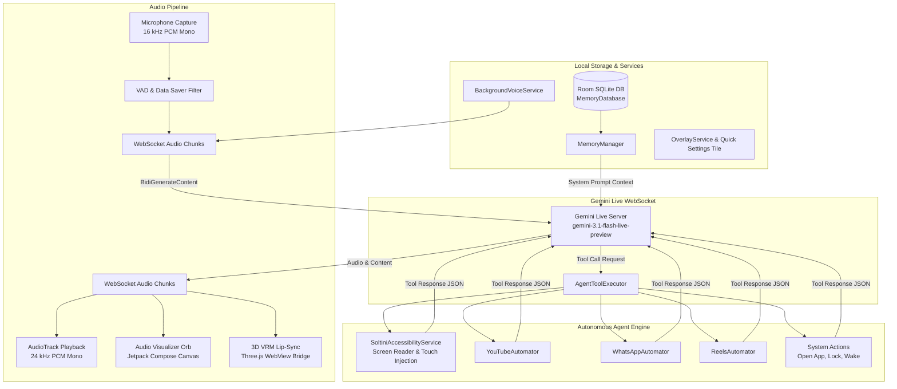

# Soltini — Next-Gen Gemini Live Voice Assistant & Autonomous Agent for Android

<div align="center">

[](LICENSE)
[](https://ai.google.dev/)
[-3DDC84?logo=android&logoColor=white)](https://developer.android.com)
[](https://kotlinlang.org/)
[](https://developer.android.com/jetpack/compose)

**Full-Duplex Real-Time Voice • Interactive 3D VRM Avatar • Autonomous Device & App Control • Persistent Long-Term Memory**

</div>

---

## 📖 Overview

**Soltini** is an advanced, always-on AI voice assistant and autonomous agent for Android powered by Google's bidirectional WebSocket streaming model (`gemini-3.1-flash-live-preview`). 

Unlike traditional turn-based assistants, Soltini provides **true full-duplex conversational voice**, ultra-low latency interruptibility, native screen perception, direct device automation (YouTube, WhatsApp, Instagram Reels, OS-level navigation), an interactive 3D VRM avatar overlay, and localized persistent memory with SQLite/Room.

---

## ✨ Key Features

### 🎙️ Real-Time Full-Duplex Voice (`Gemini Live API`)
- **Bidirectional WebSocket Connection**: Connects to `wss://generativelanguage.googleapis.com` using the `gemini-3.1-flash-live-preview` model.
- **Ultra-Low Latency Audio Streaming**: Real-time 16 kHz PCM audio recording with 24 kHz PCM audio playback.
- **Real-Time Interruption Handling**: Instantly silences audio and clears buffers when the user begins speaking.
- **Smart Voice Activity Detection (VAD)** & configurable Data Saver mode to conserve bandwidth and battery.

### 🤖 Autonomous Device & Screen Agent
- **Screen Perception**: Reads live UI hierarchies dynamically through Android Accessibility APIs.
- **Direct System Control**: Launch any installed application by name, lock the screen, wake device via WakeLock, navigate Back/Home/Recents.
- **UI Automation & Gestures**: Tap by coordinates $(x, y)$, click elements by text, perform directional swipes, type text, and scroll.
- **YouTube Automator**: Hands-free search, play/pause, seek forward/back, skip ads, like/dislike, subscribe, toggle captions, and switch to fullscreen.
- **WhatsApp & Social Automator**: Automated message sending, voice calling, and continuous Instagram Reels scrolling.

### 🎭 3D VRM Avatar & Floating System Overlay
- **Live 3D Avatar**: Real-time 3D avatar rendering using WebGL/Three.js inside an optimized native WebView bridge (`soltini.vrm`).
- **Real-Time Lip Sync**: Dynamic viseme morphing synchronized with incoming audio streams.
- **Draggable Floating Overlay**: Minimalist floating pill/orb with dynamic glow rings that remain accessible across all apps.

### 🧠 Persistent Long-Term Memory
- **Local Room Database**: Securely stores personal facts, user preferences, and interaction history on-device.
- **Context Injection**: Automatically injects relevant memories into the Gemini Live system instructions during connection initialization.

### 🛡️ Privacy & Banking Protection Mode
- **Quick Settings Tile**: One-tap toggle to immediately pause microphone recording and accessibility hooks when opening financial or privacy-sensitive apps.

### ⚡ Background Resilience & OS Integration
- **Default Assistant Role**: Registers as an official Android Voice Interaction Service (`AssistLaunchActivity`), replacing or supplementing Google Assistant.
- **Always-On Foreground Service**: Foreground execution with WakeLock management and boot receiver (`BOOT_COMPLETED` & `MY_PACKAGE_REPLACED`).
- **MIUI / HyperOS / EMUI Optimizations**: Dedicated onboarding to guide users through auto-start permissions, battery restrictions, and restricted accessibility settings.

---

## 🏗️ System Architecture



---

## 🛠️ Agentic Tool Execution Matrix

Gemini autonomously invokes local Kotlin functions based on user requests:

| Category | Tool Name | Arguments | Description |
| :--- | :--- | :--- | :--- |
| **System** | `open_app` | `app_name: String` | Searches installed package names and launches the target application. |
| **System** | `lock_device` | None | Locks the phone screen using accessibility global actions. |
| **System** | `wake_device` | None | Wakes up the display using `PowerManager.WakeLock`. |
| **System** | `press_back` / `press_home` / `press_recents` | None | Triggers standard Android hardware navigation events. |
| **Screen** | `read_screen` | None | Parses the current screen hierarchy and returns all visible text. |
| **Screen** | `click_element` | `text: String` | Finds and clicks any UI node matching target text. |
| **Screen** | `tap_screen` | `x: Float, y: Float` | Dispatches a precise touch gesture at specified screen coordinates. |
| **Screen** | `swipe_screen` | `x1, y1, x2, y2, durationMs` | Injects smooth swipe or drag gestures between coordinate pairs. |
| **Screen** | `type_text` | `text: String` | Inputs text into the currently focused EditText element. |
| **Screen** | `scroll_down` / `scroll_up` | None | Performs programmatic scroll actions on scrollable containers. |
| **YouTube** | `youtube_search` | `query: String` | Searches YouTube for videos and playlists. |
| **YouTube** | `youtube_open_video` | `video_id: String` | Directs playback to a specific video identifier. |
| **YouTube** | `youtube_play_pause` | None | Toggles video playback. |
| **YouTube** | `youtube_seek` | `seconds: Int` | Seeks forward or backward in the active video. |
| **YouTube** | `youtube_skip_ad` | None | Automatically detects and clicks the "Skip Ad" button. |
| **YouTube** | `youtube_like` / `youtube_subscribe` | None | Interacts with channel actions on the active video. |
| **WhatsApp**| `whatsapp_send_message` | `contact_name, message` | Opens chat with contact and sends message automatically. |
| **WhatsApp**| `whatsapp_call` | `contact_name` | Initiates a direct WhatsApp voice call. |
| **Reels** | `next_reel` / `previous_reel` | None | Swipes to subsequent or prior short-form video reels. |

---

## 📁 Project Structure

```
soltiniapp/
├── app/
│   ├── build.gradle.kts           # App-level dependencies & Secrets plugin
│   └── src/main/
│       ├── AndroidManifest.xml    # Permissions, Services, Receivers & Assistant hooks
│       ├── assets/
│       │   ├── avatar/            # 3D VRM WebGL engine & soltini.vrm model
│       │   └── web/               # Web assets, audio-worklet & bundle
│       ├── java/com/soltini/app/
│       │   ├── MainActivity.kt    # Navigation & Compose root
│       │   ├── BootReceiver.kt    # System boot & update auto-restart
│       │   ├── agent/             # Autonomous agent tools & Accessibility Service
│       │   │   ├── AgentToolExecutor.kt
│       │   │   ├── BackgroundAgentRunner.kt
│       │   │   ├── SoltiniAccessibilityService.kt
│       │   │   ├── YouTubeAutomator.kt
│       │   │   ├── WhatsAppAutomator.kt
│       │   │   └── ReelsAutomator.kt
│       │   ├── assistant/         # Android Assistant role implementation
│       │   │   ├── AssistLaunchActivity.kt
│       │   │   ├── SoltiniVoiceInteractionService.kt
│       │   │   └── SoltiniVoiceInteractionSession.kt
│       │   ├── audio/             # Low-latency AudioRecord & AudioTrack PCM handlers
│       │   │   ├── AudioRecorder.kt
│       │   │   └── AudioPlayer.kt
│       │   ├── bridge/            # Native-to-JavaScript WebView bridge
│       │   │   └── AriaNativeBridge.kt
│       │   ├── memory/            # Room SQLite memory persistence
│       │   │   ├── MemoryDatabase.kt
│       │   │   └── MemoryManager.kt
│       │   ├── network/           # Gemini Live WebSocket streaming client
│       │   │   └── GeminiLiveManager.kt
│       │   ├── overlay/           # System alert window floating avatar & glow ring
│       │   │   ├── OverlayService.kt
│       │   │   └── RingIndicatorView.kt
│       │   ├── services/          # Always-on voice & Quick Settings tiles
│       │   │   ├── BackgroundVoiceService.kt
│       │   │   └── BankingModeTileService.kt
│       │   ├── settings/          # SharedPreferences configuration
│       │   │   └── AppSettings.kt
│       │   ├── ui/                # Jetpack Compose screens & visualizers
│       │   │   ├── VoiceScreen.kt
│       │   │   ├── SettingsScreen.kt
│       │   │   ├── PermissionsScreen.kt
│       │   │   ├── MiuiOnboardingScreen.kt
│       │   │   ├── LogScreen.kt
│       │   │   └── components/AudioVisualizerOrb.kt
│       │   └── util/
│       │       └── AppLogger.kt
│       └── res/                   # XML configs, icons, drawables, strings
├── gradle/                        # Gradle wrapper & version catalogs
├── build.gradle.kts               # Root build configuration
├── settings.gradle.kts            # Project repositories & modules
├── .env.example                   # API key template
├── LICENSE                        # Source-Available Personal License
└── README.md                      # Project documentation
```

---

## 🚀 Getting Started

### Prerequisites

1. **Android Studio**: Android Studio Koala / Ladybug / Meerkat or newer.
2. **JDK**: Java Development Kit (JDK 17 or 21).
3. **Android Device / Emulator**:
   - Physical device recommended for testing AudioRecord, Overlay, and Accessibility features.
   - Minimum SDK: `Android 8.0 (API Level 26)`.
   - Target SDK: `Android 15 (API Level 35/36)`.
4. **Google Gemini API Key**: Obtain a key with Gemini Live API access from [Google AI Studio](https://aistudio.google.com/).

---

### Step-by-Step Installation

#### 1. Clone or Open the Project
Open the `soltiniapp` folder in Android Studio:
```bash
# In terminal or Android Studio
cd soltiniapp
```

#### 2. Configure Environment Variables
Copy `.env.example` to `.env` in the root of the `soltiniapp` directory:
```bash
cp .env.example .env
```
Open `.env` and add your Gemini API key:
```ini
GEMINI_API_KEY=AIzaSyYourActualGeminiApiKeyHere
```
> **Note**: The Gradle Secrets plugin reads `.env` during the build process and injects `BuildConfig.GEMINI_API_KEY`. You can also change the API key dynamically from the in-app **Settings** screen at runtime.

#### 3. Build & Run
- Connect your Android device via USB (with **USB Debugging** enabled).
- Select the `app` run configuration in Android Studio.
- Click **Run (Shift + F10)** to compile and install the APK onto your device.

---

## 📱 Permissions & OS Setup Guide

For full autonomy and seamless background operation, enable the following permissions within the app or system settings:

1. **Microphone (`RECORD_AUDIO`)**:
   - Required for real-time speech input. Prompted on first launch.
2. **Display Over Other Apps (`SYSTEM_ALERT_WINDOW`)**:
   - Enables the floating 3D avatar and overlay ring indicator.
3. **Accessibility Service (`SoltiniAccessibilityService`)**:
   - Enables screen reading, coordinate tapping, typing, scrolling, screen locking, and app automations.
   - *Android 13+ Sideloaded APKs*: Go to **Settings → Apps → Soltini → Three Dots (top right) → "Allow restricted settings"**, then enable Soltini in **Accessibility**.
4. **Default Digital Assistant (`ROLE_ASSISTANT`)**:
   - Set Soltini as your default assistant under **Settings → Apps → Default apps → Digital assistant app** to activate Soltini when holding the Home/Power button.
5. **Battery Optimization Whitelist**:
   - Set Battery usage to **"Unrestricted"** so the OS does not kill background voice listening.
6. **Xiaomi / Redmi / POCO / HyperOS Specifics**:
   - Enable **Auto-start**.
   - Set MIUI Battery Saver to **"No restrictions"**.
   - Enable **"Display pop-up windows while running in the background"**.

---

## ⚙️ Configuration & Customization

The app provides deep customization via the **Settings Screen** or `AppSettings.kt`:

- **AI Voice Persona**: Customize system prompt behaviors (Soltini Default, Minimal Assistant, Technical Pro, Friendly Companion, or Custom).
- **Voice Selection**: Choose between official Gemini voices (`Aoede`, `Kore`, `Puck`, `Charon`, `Fenrir`).
- **VAD Sensitivity**: Adjust Voice Activity Detection thresholds (`Low: 0.020`, `Balanced: 0.010`, `High: 0.005`).
- **Microphone Gain**: Boost or attenuate input volume (0.5x to 3.0x).
- **Data Saver Mode**: Automatically silences and suppresses audio frame transmissions during silence.
- **Auto-Sleep Timer**: Automatically disconnects WebSocket streaming after 1 to 60 minutes of inactivity.
- **Persistent Memory Toggle**: Enable or clear local user fact storage.

---

## 🔍 Debugging & Logs

- **Built-in Log Viewer**: Access the real-time in-app log viewer by navigating to the **Logs** tab in the main interface.
- **Logcat Tag Filtering**:
  ```bash
  adb logcat -s GeminiLiveManager:V AgentToolExecutor:V BackgroundVoiceService:V SoltiniAccessibilityService:V
  ```

---

## 📜 License & Terms of Use

This project is licensed under a **Source-Available, Personal & Non-Commercial Use Only License**.

```
Source-available software — Personal & Educational Use Only
Copyright (c) 2024-2026 Soltini App Contributors. All rights reserved.

This project is source-available for personal, educational, and research evaluation only.
Commercial use, redistribution, sublicensing, and publication of the source code or 
derivative works are strictly prohibited without prior written permission.
```

For full legal terms and conditions, refer to the [LICENSE](LICENSE) file.

---

<div align="center">
Made with ❤️ for next-generation conversational AI on Android.
</div>
